# BenefitsIntelligence

Turns unstructured employee-benefit policy documents into structured, validated, queryable benefit data.

Policy PDFs are uploaded through an ASP.NET Core API and processed asynchronously by a Python document-intelligence worker over RabbitMQ. The worker extracts a canonical benefits model with an LLM, validates it with Pydantic and attaches verified source evidence to every fact. The .NET side owns persistence, tenancy and all deterministic business logic, such as policy comparison and what needs human review, so model output is never treated as the source of truth.

## About this project

This is a proof of concept, not a production system. It explores an architecture for turning benefit policy documents into evidence-backed data: an asynchronous .NET and Python pipeline in which AI output is always verified before it is trusted. It uses two synthetic sample policies, supports one policy type, and has deliberate gaps, such as authentication and retry handling, described under [Authentication](#authentication) and [Limitations and next steps](#limitations-and-next-steps).

## Walkthrough

**Policies.** Upload a policy document; its key terms are extracted with their sources.

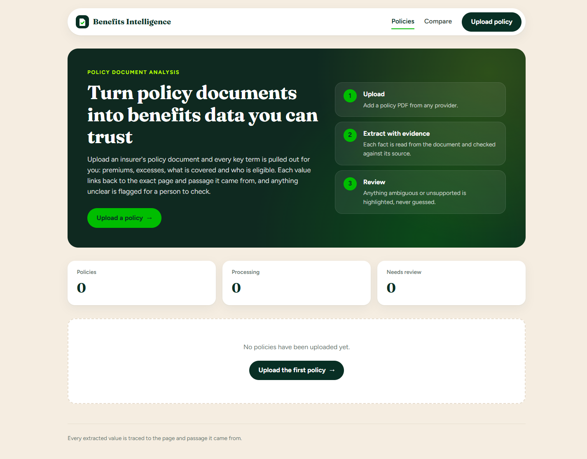

**Upload.** Choose a PDF and the document is queued for processing.

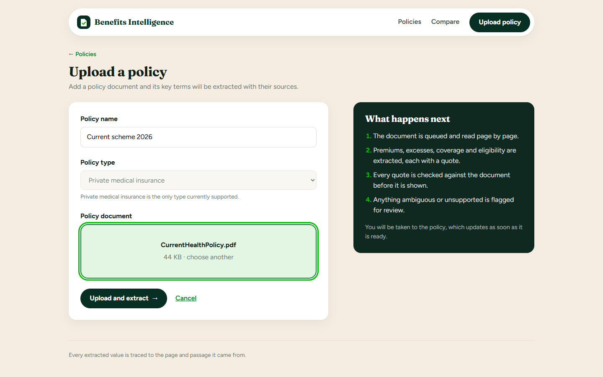

**Processing.** The API accepts the upload immediately and the worker processes it in the background; the page updates itself when extraction finishes.

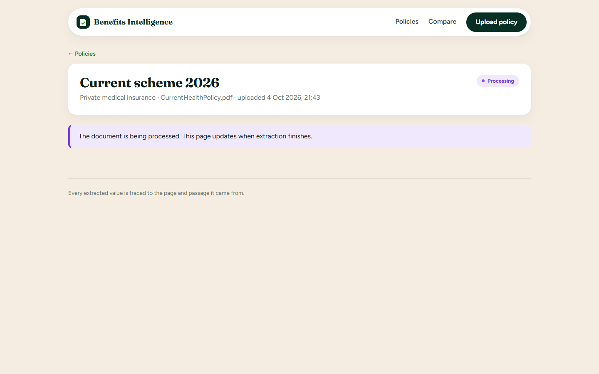

**Extracted policy.** Every value shows the model's confidence and the page and passage it was read from. Each quote is checked against the document before it is shown.

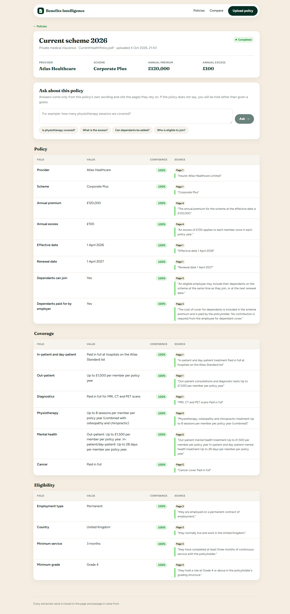

**Review.** Anything ambiguous, unsupported or low-confidence is flagged for a person to check rather than guessed. Here the proposed policy leaves the cost of dependant cover open.

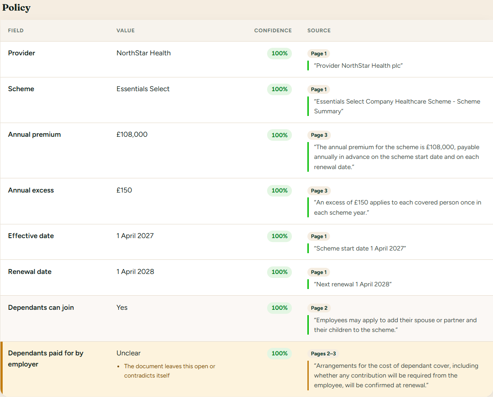

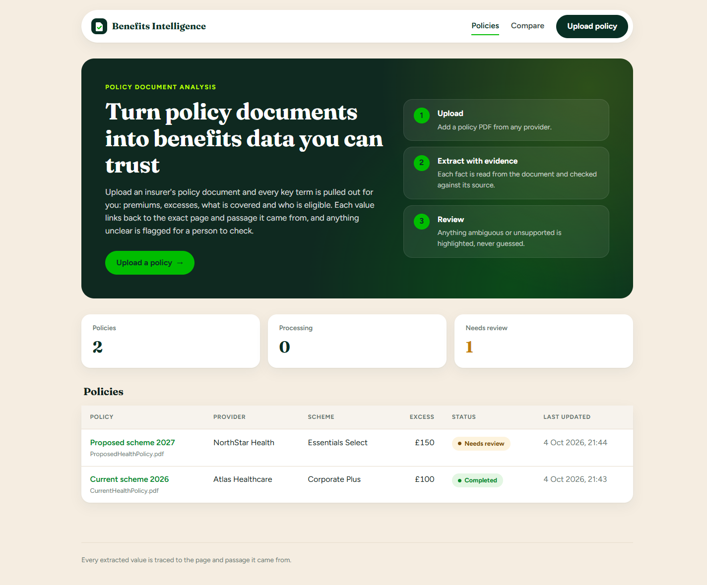

**Comparison.** Differences are calculated in code from the structured facts, never by a model. Differences that rely on an unconfirmed fact are flagged.

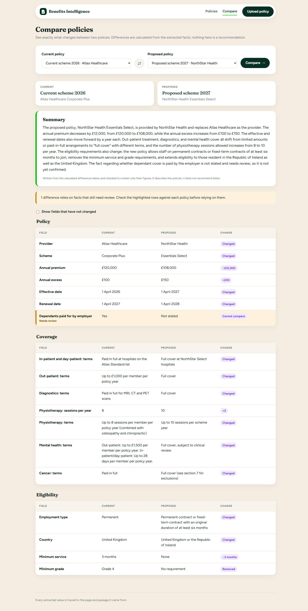

**Summary.** An optional written summary is produced from the calculated differences only. It is checked to use only their figures and no evaluative language, and it never recommends either policy.


**Questions.** Answers come only from the policy's own wording and cite the pages they rely on. A judgement question is answered with what the policy states; a question the policy does not answer is refused rather than guessed.

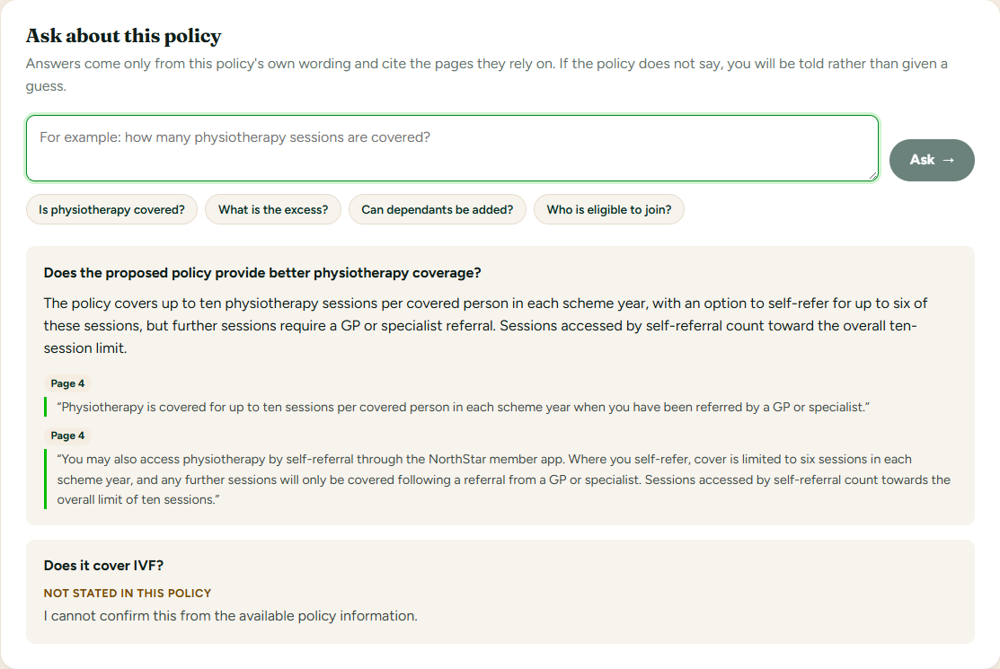

## Architecture

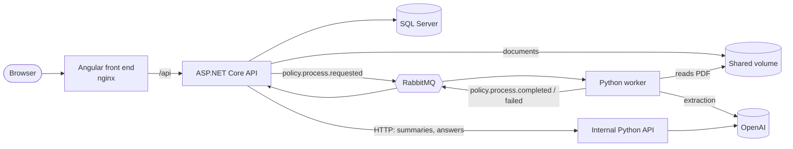

| Component | Technology | Responsibility |
| --- | --- | --- |
| `src/BenefitsIntelligence.Web` | Angular 21 | Upload, status, evidence-backed policy detail, comparison and questions |
| `src/BenefitsIntelligence.Api` | ASP.NET Core (.NET 10) | Public API and orchestration |
| `src/BenefitsIntelligence.Application` | .NET class library | Use cases |
| `src/BenefitsIntelligence.Domain` | .NET class library | Domain model and deterministic rules (review policy, comparison) |
| `src/BenefitsIntelligence.Infrastructure` | .NET class library | Persistence, messaging and the internal API client |
| `src/python` | Python 3.13, uv, FastAPI | Document parsing and LLM extraction (queue worker); comparison summaries and answers (internal HTTP API) |
| RabbitMQ | `rabbitmq:4-management` | Asynchronous document-processing pipeline |
| SQL Server | `mssql/server:2022` | System of record |

Dependencies point inwards: `Api → Application → Domain`, with `Infrastructure` implementing the `Application` abstractions. The worker and the internal API are two entry points into the same Python package, run as separate containers from one image.

### Messaging

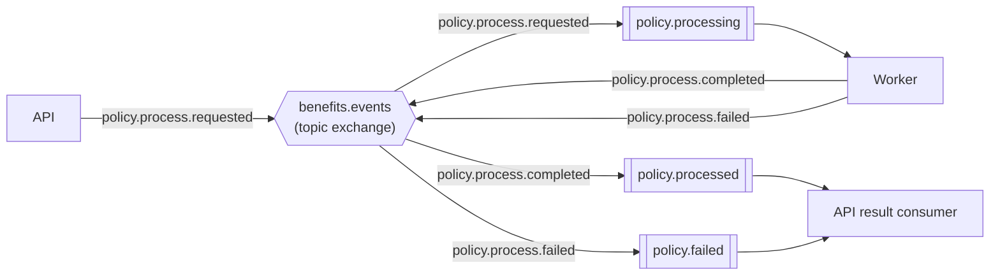

Queues are durable and messages persistent. The API publishes with confirms and the `mandatory` flag; the worker takes one message at a time and acknowledges a request only after its result has been confirmed by the broker. Results are applied idempotently: a redelivered completion cannot change a job that has already been recorded. Message contracts are snake_case JSON with a schema version, and shared fixtures in `contracts/fixtures` are tested from both C# and Python so the two sides cannot drift apart.

### Processing an upload

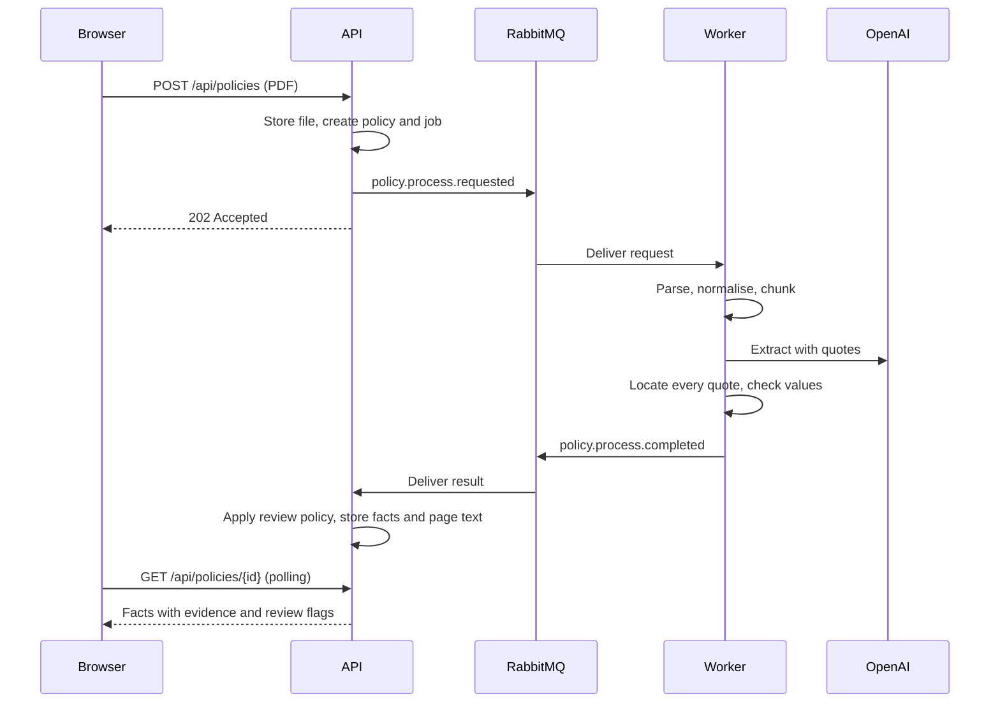

A correlation ID travels with every message and appears in the structured logs of both the API and the worker, so one upload can be followed from request to result. Calls to the internal API carry the originating request's trace ID in the same way.

## Getting started

### Prerequisites

- [.NET SDK](https://dotnet.microsoft.com/download) (version pinned in `global.json`)
- [Docker Desktop](https://www.docker.com/products/docker-desktop/)
- [uv](https://docs.astral.sh/uv/getting-started/installation/), which also provisions the pinned Python version
- [Node.js](https://nodejs.org/) 22.12 or later, for the web front end
- An OpenAI API key

Copy the environment template and set real values first, including `OPENAI_API_KEY` and an `INTERNAL_API_KEY` of at least 32 characters:

```powershell
Copy-Item .env.example .env
```

### Run everything in Docker

Builds and starts the web front end, the API, the processing worker, the internal AI API, RabbitMQ and SQL Server. The database schema is created on first start.

```powershell
docker compose --profile app up --build
```

| Service | Address |
| --- | --- |
| Web front end | http://localhost:8081 |
| API reference (Scalar) | http://localhost:8080/scalar |
| RabbitMQ management UI | http://localhost:15672 |
| SQL Server | `localhost,1433` (login `sa`) |

The API and worker share uploaded documents through the `documents` volume. The front end is served by nginx, which also proxies `/api` to the API, so the browser talks to a single origin and the API needs no CORS configuration. The internal Python API publishes no port and is reachable only from the API on the compose network.

[`docs/WALKTHROUGH.md`](docs/WALKTHROUGH.md) steps through the sample policies, including the questions to ask.

### Develop locally

`docker compose up -d` without the profile starts only RabbitMQ and SQL Server, leaving the API, worker and front end to run from the IDE. Do not run the `app` profile at the same time: both sets of services would consume the same queues.

**.NET** (connection details come from user secrets):

```powershell
dotnet tool restore
dotnet user-secrets set "ConnectionStrings:BenefitsIntelligence" "Server=localhost,1433;Database=BenefitsIntelligence;User Id=sa;Password=<MSSQL_SA_PASSWORD>;TrustServerCertificate=True" --project src/BenefitsIntelligence.Api
dotnet user-secrets set "RabbitMq:UserName" "<RABBITMQ_USER>" --project src/BenefitsIntelligence.Api
dotnet user-secrets set "RabbitMq:Password" "<RABBITMQ_PASSWORD>" --project src/BenefitsIntelligence.Api
dotnet user-secrets set "PythonApi:ApiKey" "<INTERNAL_API_KEY>" --project src/BenefitsIntelligence.Api
dotnet tool run dotnet-ef database update --project src/BenefitsIntelligence.Infrastructure --startup-project src/BenefitsIntelligence.Api
dotnet run --project src/BenefitsIntelligence.Api --launch-profile http
```

The API listens on http://localhost:5209 (Scalar at `/scalar`). Uploaded documents are written to `data/` at the repository root. The database is migrated automatically only in Docker; locally, apply new migrations after pulling changes with the `dotnet-ef database update` command above.

**Python worker and internal API** (both read `.env` from the repository root; run each in its own terminal):

```powershell
cd src/python
uv sync
uv run policy-worker
uv run policy-api
```

The internal API listens on http://127.0.0.1:8000, with interactive docs at `/docs`.

**Web front end** (proxies `/api` to the API on port 5209, see `src/proxy.conf.json`):

```powershell
cd src/BenefitsIntelligence.Web
npm install
npm start
```

The app is served at http://localhost:4200. The front end is also part of the .NET solution as a JavaScript project, so Visual Studio can start it alongside the API.

## Testing

```powershell
dotnet test
cd src/python
uv run pytest
uv run ruff check .
cd ../BenefitsIntelligence.Web
npm test
```

| Suite | Covers |
| --- | --- |
| .NET (xUnit) | Domain rules (status transitions, review policy, comparison), result handling and idempotency, organisation scoping, message contracts, the internal API client |
| Python (pytest) | Parsing, normalisation and chunking, evidence location, extraction assembly, output guards, retrieval, answering and summarising with a fake model, the FastAPI endpoints, message contracts |
| Angular (Vitest) | Dashboard, upload, policy, comparison and question components, formatting and polling |
| Live (`uv run pytest -m live`) | Extraction, summaries and answers against the sample policies with the real model, compared with the recorded expected answers. Excluded by default because they call the OpenAI API. |

The GitHub Actions workflow in `.github/workflows/ci.yml` builds and tests all three stacks on every push and pull request. It needs no secrets, as the live tests are not run there.

## Design decisions

**Document text pipeline.** PDFs are parsed page by page with PyMuPDF, normalised, and split into sentence-aligned chunks. Page boundaries are tracked through every stage so any extracted fact can be traced back to the page it came from.

- **ftfy** repairs extracted text (ligatures, mis-decoded characters, curly quotes). It was preferred over Unicode NFKC normalisation, which also rewrites symbols such as `½` and `m²`.
- **tiktoken** sizes chunks in model tokens rather than characters, so chunk budgets match how the model is limited and billed.
- **Running header and footer removal, and page-offset mapping, are implemented in-house.** No mainstream library provides page-accurate evidence location, and it is central to the product.
- **LangChain text splitters and frameworks such as LlamaIndex and unstructured were not used.** They add significant dependency weight and do not track page provenance.
- **PyMuPDF is AGPL-licensed.** A production deployment would need a commercial licence or a permissively licensed alternative such as pdfplumber.

**Extraction and review.** The model returns each value with the passage it was read from; everything else is checked in code. Each quote is located in the document text, which is where the cited pages come from, so a quote the document does not contain produces no evidence. Matching tolerates case, punctuation and spacing differences only: measured against the samples, a fabricated quote that reverses a clause's meaning scores close to a genuinely misquoted one, so a looser threshold would accept it. Amounts and dates must also appear in their own quote. The worker reports confidence and any problems found; the API decides what needs review (`Review:ConfidenceThreshold`), so the review policy can change without re-extracting documents. In practice the model reports near-certain confidence even for ambiguous clauses, so the deterministic checks carry most of the weight.

- **gpt-4.1 is the default model.** gpt-4.1-mini intermittently corrupted the `£` sign in structured output, changing the digits that followed it. Model text containing control characters is now rejected rather than stored.
- **rapidfuzz** provides the tolerant quote matching.

**Comparison.** Two policies are compared field by field in the .NET domain (`PolicyComparer`): amounts and counts as increases or decreases with their size, other values as changed or unchanged, and anything missing on either side as not comparable rather than guessed. Differences that rely on a fact needing review are flagged. The written summary is optional and produced by the internal Python API from the calculated differences, never from the documents. Every figure is formatted in code before the model sees it, and a summary is rejected if it uses evaluative language ("better", "recommend") or any figure not in the comparison. If no summary can be produced, the comparison is returned without one. The UI deliberately shows every change in the same neutral style, since colouring one as good and another as bad would itself be a judgement.

**Questions.** Each processed policy keeps its page text in the database, so the internal Python API holds no data of its own: the API checks the caller's organisation and sends the question with that policy's pages. Python rebuilds the document with the same normaliser and chunker used during extraction, ranks passages with BM25, and asks the model for an answer with exact quotes. Every quote is located in the document, which is where the cited pages come from; quotes that cannot be found are dropped. If the policy does not state the answer, or nothing verifiable is left, the response is a fixed refusal rather than a guess. Questions asking for a judgement or advice are answered with what the policy states about the topic, and answers containing evaluative language or figures not in the cited passages are rejected. An evaluative word is allowed only where the answer repeats the policy's own wording ("when recommended by a consultant psychiatrist").

**Queue or HTTP.** Work that takes seconds to minutes, benefits from retries and does not need an immediate answer, such as document processing, goes through RabbitMQ. Requests a user is waiting on and that are quick, such as comparison summaries and questions, use HTTP to the internal API, with a timeout and a fallback.

**Sample data.** `sample-data/policies` holds the wording of two synthetic policies, rendered to PDF by `src/python/scripts/render_sample_policies.py`. `sample-data/expected` records the known answers, the evidence for each, and deliberately planted edge cases: conflicting limits, eligibility defined across sections, an ambiguous clause and an embedded prompt-injection attempt. Tests check that every expected evidence quote can be located in the rendered documents.

## Security

- **Tenant isolation.** Every query is scoped to the caller's organisation in .NET; a policy belonging to another organisation is reported as not found rather than forbidden, so its existence is not revealed. The organisation comes from the API, never from document content: messages carry the tenant ID set by the API, and the Python services hold no data of their own.
- **Prompt injection.** Document text and user questions are passed to the model only as delimited data, after fixed instructions that say they may contain instructions and must not be followed; the delimiters cannot be closed early from inside the text. The sample proposed policy contains an embedded injection attempt, and the extraction is tested to ignore it. Beyond the prompt, every quote is verified against the document and outputs are checked in code, so an injected claim cannot become a stored fact without evidence.
- **Trust boundaries.** Model output is treated as untrusted input: it is validated, converted to exact types and checked before anything is stored or shown.
- **Least privilege.** The internal Python API publishes no port, requires a shared secret compared in constant time, has no RabbitMQ credentials and no database access. The worker mounts the document volume read-only. Containers run as a non-root user.
- **Secrets.** Keys are supplied through environment variables and user secrets, never committed. Settings use `SecretStr` in Python so keys are not written to logs.
- **Uploads.** Files are checked for a PDF signature and size limit before storage, stored under generated names, and the worker treats the stored location as untrusted when resolving it.
- **Personal data.** Policy documents are scheme-level and do not identify individuals. A production deployment would add encryption at rest for stored documents and text, a retention policy, and data processing terms with the model provider.

## Authentication

Authentication was designed but not built for this version. The intended approach:

- **Microsoft Entra ID** for sign-in, with MSAL in the Angular app and an HTTP interceptor attaching the access token to `/api` calls. The same-origin proxy means no CORS changes are needed.
- **JWT bearer authentication** in the API with `Microsoft.Identity.Web`, and an authenticated-user policy on all `/api` endpoints.
- **The organisation from token claims** (or a user-to-organisation mapping), replacing the single seeded organisation that endpoints use today, plus an EF Core global query filter so tenant scoping cannot be forgotten in a new query.
- **Integration tests** with a test authentication handler: unauthenticated requests return 401, and one organisation cannot read another's policies.

The code is already shaped for this: the organisation ID flows through every use case, query and message, and cross-tenant access is already tested to return not found.

## Limitations and next steps

- **Retries and dead-lettering.** Messages that fail unexpectedly are rejected without retry. A retry queue with backoff and a dead-letter queue would make transient failures recoverable and permanent ones visible.
- **Outbox.** An upload is accepted even if publishing to RabbitMQ fails, but the job then stays queued. A transactional outbox would publish reliably once the broker is available.
- **Human review.** Fields needing review are flagged but cannot yet be confirmed or corrected in the UI with an audit trail.
- **Live updates.** Pages poll while processing; SignalR would push status changes instead.
- **Evaluation.** The live tests check two sample policies. A larger synthetic set with per-field accuracy and refusal-rate reporting would measure extraction quality as prompts and models change.
- **Policy types.** Only private medical insurance is modelled.

## Conventions

- Package versions are managed centrally in `Directory.Packages.props`. Do not put `Version` on `PackageReference` items.
- Shared compiler settings live in `Directory.Build.props`. Warnings are treated as errors.
- .NET code style is enforced by `.editorconfig`. Python linting and formatting are configured in `src/python/pyproject.toml`, and the front end uses Prettier.
- Python dependencies are locked in `src/python/uv.lock`. Add them with `uv add` (or `uv add --dev`) rather than editing the file by hand.
- Secrets are supplied through `.env`, which is never committed. `.env.example` lists the required keys.
